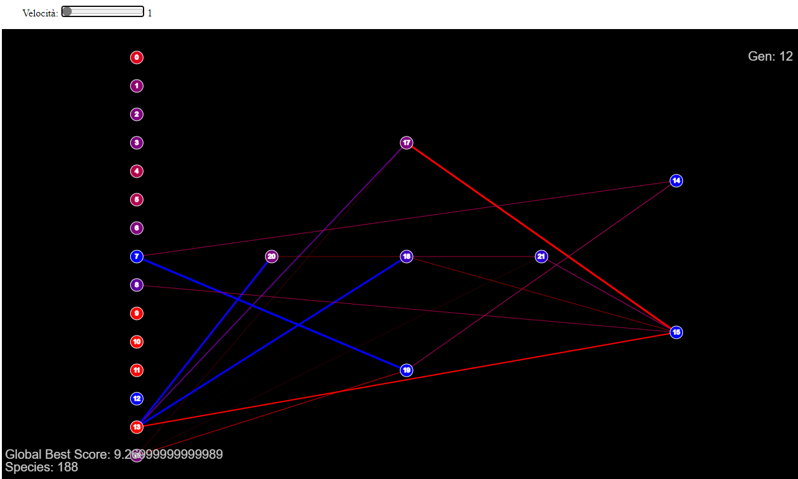
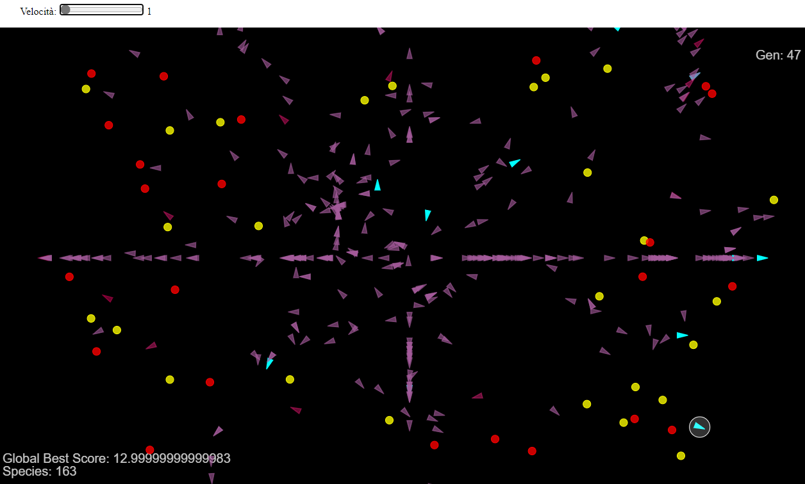

# NEAT Template JavaScript
**Usage**

 - start running index.html
 - Keyboard commands:
  --*n*: show vehicles
  --*b*: show healthier vehicle's brain
  --*slide*: speed up evolution
 
**Thank to**
NEAT implementation by Code-Bullet
https://github.com/Code-Bullet/NEAT-Template-JavaScript
Vehicles implementation by Daniel Shiffmann
 
Nature of Code: Intelligence and Learning
https://github.com/shiffman/NOC-S17-2-Intelligence-Learning
Evolutionary "Steering Behavior" Simulation

**Screenshots**

*The brain*

*Life on screen*

